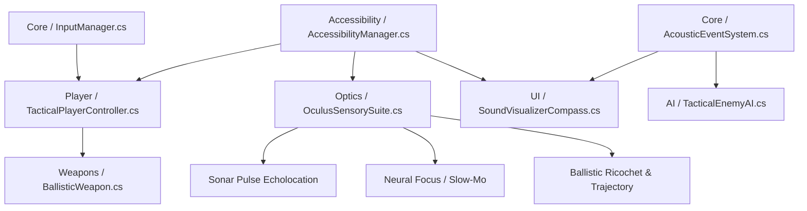

# 🧠 PROJECT MEMORY & MULTI-AGENT COORDINATION PROTOCOL
**Project:** *Echoes of Neon* — Accessible Tactical Cyber-Noir FPS  
**Target Engine:** Unity 6.6.0f1 (installed, real project exists - see Changelog)  
**Location:** `Desktop/EchoesOfNeon/`  
**Last Updated:** 2026-09-13 (blueprint-gap session - narrative docs infra, Phase 2
accessibility announcements, a new Library-corruption + possible Accessibility-
permission gotcha - see resume point and changelog)  

> [!NOTE]
> ### Resume point (2026-09-13, blueprint-gap session)
> Orlando shared an "Accessible Unity Game Blueprint" template and asked what parts of
> it this project hasn't touched yet. Answer: engine/systems work (Phases 0-6 below)
> is far along, but the entire narrative layer, the dual review-agent system, and docs
> infrastructure didn't exist at all. This session built that missing layer - see
> `CLAUDE.md` (new) and the `Docs/` tree (new, see directory map below) - plus fixed a
> real code gap an audit found: `AccessibilityManager.Announce()` was never called
> anywhere in gameplay code before this session, despite the hook existing and
> compiling. See the Changelog entry below for exactly what changed.
>
> **Two new environment gotchas found this session, both relevant next time a build
> needs verifying:**
> 1. **Rebuilding after Library predates code changes can produce a corrupted
>    player** - hit a `level0` "is corrupted!" crash on first launch after building
>    with an existing `Library/`. Same class of issue as the tvOS/Mac switch bug
>    already documented further down this file. Fix was the same: delete `Library/`
>    (and `Temp/`) and let Unity do a full clean reimport before rebuilding. If a
>    freshly-built player crashes with a "corrupted" data-file message, this is the
>    fix - don't assume it's a real code bug first.
> 2. **A freshly-rebuilt Mac binary may trigger a NEW macOS Accessibility permission
>    prompt** - after the clean rebuild above, the app process launched and stayed
>    alive but produced zero Unity engine log output; the macOS unified log showed a
>    `TCCAccessRequest` (Accessibility service) IPC call right before it went quiet,
>    consistent with a system permission dialog blocking headless progress. Couldn't
>    confirm or dismiss this without GUI interaction - **check System Settings >
>    Privacy & Security > Accessibility for `EchoesOfNeon_Test` next time this
>    happens, and grant it if prompted.** This is a different permission than the
>    already-documented Input Monitoring one below - likely triggered by
>    `AssistiveSupport.activeHierarchy` usage in `AccessibilityManager.cs`, though
>    that's not yet confirmed as the actual cause.
>
> **Google Antigravity is also being used on this project now** (confirmed running on
> this Mac this session). Agreed approach with Orlando: never run both tools on the
> same working directory at once, commit before switching between them, check `git
> log`/`git status` at the start of either tool's session, and point Antigravity at
> this file too - its "Mandatory AI Agent Protocol" is written for "an AI agent," not
> specifically Claude.
>
> **Narrative content deliberately NOT drafted this session** - Orlando asked for
> fill-in intake forms (open questions) instead of a fully-drafted story bible/
> characters/scenes, so `Docs/Story/Narrative/story-intake-form.md`,
> `.../Dialogue/dialogue-intake-form.md`, and `.../Audio/audio-intake-form.md` are
> questionnaires, not content. **Next session, in order:**
> 1. Answer those three intake forms (or as much as is ready) - everything
>    downstream (character files, scene files, the narrative review checklist
>    actually being runnable) depends on them.
> 2. Get a real live Mac test in - VoiceOver on, real keyboard/controller - covering
>    both the long-standing open items in `Docs/playtest-log.md` (carried over from
>    before this session) AND this session's new announcements (enemy state changes,
>    Neural Dilate, sonar contact, footstep audio). If the Accessibility-permission
>    hang above recurs, that's the first thing to resolve before anything else can be
>    tested.
> 3. Only then continue toward the rest of Phase 6 (shaders, real level design) -
>    both still need visual verification a human has to do.

---

> [!IMPORTANT]
> ### 🤖 MANDATORY AI AGENT PROTOCOL (READ BEFORE MAKING CHANGES)
> If you are an AI agent working on this codebase:
> 1. **READ FIRST:** Review this entire `MEMORY.md` file before starting any task to understand current architecture, conventions, and active work.
> 2. **CHECK ACTIVE WORK:** Look at the **[Task Tracking & Roadmap](#-task-tracking--roadmap)** section to avoid duplicate work or stepping on in-progress tasks.
> 3. **PRESERVE ARCHITECTURE & PREVENT REGRESSIONS:**
>    - Do not refactor or remove existing public APIs/events without backward compatibility.
>    - Ensure all scripts adhere to decoupled event-driven architecture.
>    - Keep accessibility options modularized through `AccessibilityManager`.
> 4. **UPDATE THIS FILE AFTER EVERY TASK:** Whenever you create, modify, or test scripts, you **MUST** update:
>    - The **[Changelog & Activity Log](#-changelog--activity-log)** with your changes, files touched, and notes.
>    - The **[Task Tracking & Roadmap](#-task-tracking--roadmap)** status (mark tasks completed or add new sub-tasks).

---

## 🎮 Game Concept & Lore Bible

* **Title:** *Echoes of Neon*
* **Genre:** Single-Player Tactical / Methodical Cyber-Noir First-Person Shooter (FPS).
* **Setting:** *New Carthage* — A rain-slicked, neon-lit industrial metropolis controlled by monolithic mega-corporations.
* **Protagonist:** **Marcus "Echo" Cross**
  * Former military breach specialist turned industrial contractor.
  * Monolithic mega-corp **Aegis-Corvus Dynamics** murdered his family, stole his late wife's neural memory core, and destroyed his biological eyes to cover up illegal bioweapons experiments.
  * Rebuilt with an underground prototype cybernetic ocular suite (**Oculus Sensory Suite**), Marcus seeks revenge and answers.
* **Core Design Philosophy:** Accessibility is not an afterthought menu toggle—it is woven directly into the in-lore cyberware, HUD optics, acoustic visualization, and tactical pacing.

---

## 🏛️ Core Architectural Pillars & Systems



### 1. Accessibility & Assist Framework (`Assets/Scripts/Accessibility/`)
* **Colorblind Modes:** Full palette swaps (Protanopia, Deuteranopia, Tritanopia, High-Contrast Monochroma).
* **High-Contrast Silhouettes:** Screen-space outline shaders for enemies (red/amber), allies (cyan/green), and interactables (gold).
* **Granular Aim Assists:** Sliders for target friction (slowdown over targets) and soft magnetic snap-to-target.
* **Motor Assists:** Single-stick navigation mode, full toggle vs. hold options (ADS, Sprint, Crouch), adjustable sensitivity curves.
* **Timescale Control:** Adjustable speed multiplier during *Neural Dilate* (slow-mo).
* **Sensory Cues:** Motion sickness reduction (camera bob toggle, screen shake scaling).

### 2. Dual-Input Versatility (`Assets/Scripts/Core/`)
* Built upon **Unity New Input System** (`UnityEngine.InputSystem`).
* Seamless hot-swapping between Keyboard & Mouse and Gamepads (Xbox, PlayStation, Generic).
* Full runtime remapping with persistent JSON serialization.
* Deadzone calibration and dynamic UI button glyph updates.

### 3. Oculus Sensory Suite (`Assets/Scripts/Optics/`)
* **Sonar Pulse (Echolocation):** Expanding acoustic wave that pings geometry edges, hidden enemies, and sound sources.
* **Neural Dilate (Focus Mode):** Overclocks perception to slow down game time (`Time.timeScale`) without making player controls sluggish.
* **Predictive Ballistics:** Real-time projected ricochet trajectory and laser sighting.

### 4. 3D Sound Visualizer Compass (`Assets/Scripts/UI/`)
* Captures spatial acoustic events from `AcousticEmitter` components.
* Plots directional radar blips around the HUD / crosshair:
  * 🟠 Orange = Gunfire / Explosions
  * 🔵 Cyan = Footsteps / Movement
  * 🟡 Yellow = Mechanical / Alert Barks
* Integrated with enhanced subtitles (speaker portraits, directional indicators, high-contrast backgrounds).

### 5. Ballistic Combat & Tactical AI (`Assets/Scripts/Weapons/` & `Assets/Scripts/AI/`)
* **Vanguard 9 Suppressed Pistol:** Modular cyberware weapon framework (semi-auto, recoil damping, laser guide).
* **Acoustic Stealth Loop:** Enemies respond to noise radius and visual lines of sight; player uses sonar to assess threat levels.

---

## 📁 Directory Structure & File Map

```
EchoesOfNeon/
├── Assets/
│   ├── Scenes/                 # Level grayboxes, test ranges, lighting setups
│   ├── Scripts/
│   │   ├── Core/               # InputManager, GameManager, AcousticEventSystem
│   │   ├── Player/             # TacticalPlayerController, PlayerMotor (no PlayerHealth yet - see action-mapping.md)
│   │   ├── Accessibility/      # AccessibilityManager, ColorblindProfile, InputRemapData
│   │   ├── Optics/             # OculusSensorySuite, SonarPingEmitter, TrajectoryDrawer
│   │   ├── Weapons/            # BallisticWeapon, Projectile, WeaponCyberMod
│   │   ├── AI/                 # TacticalEnemyAI, AcousticEmitter, VisionCone
│   │   └── UI/                 # SoundVisualizerCompass, SubtitleDisplay, AccessibilityMenuUI
│   └── Shaders/                # HighContrastOutline, SonarPulseWave, ScreenSpaceSilhouette
├── Docs/                       # Created 2026-09-13 (was aspirational-only before)
│   ├── action-mapping.md       # Blueprint Section 3.4 - action -> Animator/audio/announcement
│   ├── code-review-checklist.md
│   ├── narrative-review-checklist.md
│   ├── playtest-log.md
│   ├── asset-credits.md
│   └── Story/
│       ├── Narrative/story-intake-form.md   # Open questions, not drafted content yet
│       ├── Dialogue/dialogue-intake-form.md
│       ├── Audio/audio-intake-form.md
│       ├── Characters/         # Empty - waiting on the Narrative intake form's answers
│       └── Scenes/             # Empty - waiting on the Narrative intake form's answers
├── CLAUDE.md                   # Added 2026-09-13 - points any Claude Code session at this file
├── MEMORY.md                   # 🧠 THIS FILE - Master context and agent synchronization
└── README.md                   # Quickstart guide for opening in Unity
```

---

## 🎯 Task Tracking & Roadmap

Reordered into phases 2026-09-09 to put input first (explicit user priority:
keyboard **and** game controller support) and to call out the screen-reader
architecture decision below. See the Changelog for tooling setup detail.

> [!IMPORTANT]
> ### 🦯 Screen-reader architecture decision (2026-09-09)
> Menus/UI use **Unity 6.3's native `AccessibilityNode`/`AccessibilityHierarchy`
> API** (`UnityEngine.Accessibility`), which exposes UI through Windows UI
> Automation — the same standard API NVDA reads other apps through. This is
> *why* the project targets **Unity 6.3 (`6000.3.23f1`)** instead of the 6.0
> LTS line, which predates this API entirely. Unity's own docs only list
> "Windows Narrator" as tested, not NVDA by name, but the mechanism is
> standard UIA, not Narrator-specific — NVDA compatibility is expected but
> **not yet empirically verified**; confirm live once a menu exists.
> **Live gameplay does not go through a screen reader at all** — that's what
> the Oculus Sensory Suite (sonar echolocation, sound-visualizer compass) is
> *for*. Screen readers are for static menu/UI screens only.

| Phase | Task / Feature | Module | Status | Owner / Agent | Target File(s) |
| :--- | :--- | :--- | :--- | :--- | :--- |
| 0 | Project Folder Scaffolding | Setup | ✅ Completed | System | Root directory structure |
| 0 | Multi-Agent Memory & Protocol | Docs | ✅ Completed | System | `MEMORY.md`, `README.md` |
| 0 | Unity Hub + Unity 6.3 Editor + Windows IL2CPP install | Tooling | ✅ Completed | Claude | n/a (machine-level) |
| 0 | Git repo + GitHub remote (`Zatoichi420/EchoesOfNeon`, private) | Tooling | ✅ Completed | Claude | `.gitignore` |
| 0 | Real Unity project (`ProjectSettings/`, `Packages/manifest.json`) | Setup | ✅ Completed | Claude | project root |
| 1 | Input System + URP packages installed, `activeInputHandler` set | Core | ✅ Completed | Claude | `Packages/manifest.json`, `ProjectSettings/ProjectSettings.asset` |
| 1 | `InputManager.cs` (New Input System — keyboard + gamepad) | Core | ✅ Completed (untested in a live scene) | Claude | `Assets/Scripts/Core/InputManager.cs` |
| 2 | `AccessibilityManager.cs` (incl. native screen-reader hookup) | Accessibility | ✅ Completed - `Announce()` now actually called from gameplay code as of 2026-09-13 (was previously wired but never invoked anywhere); screen-reader path itself still untested live | Claude | `Assets/Scripts/Accessibility/AccessibilityManager.cs` |
| 3 | `TacticalPlayerController.cs` | Player | ✅ Completed (untested in a live scene) | Claude | `Assets/Scripts/Player/TacticalPlayerController.cs` |
| 4 | `OculusSensorySuite.cs` (sonar, Neural Dilate, predictive ballistics) | Optics | ✅ Completed (not wired into test scene / untested live) | Claude | `Assets/Scripts/Optics/OculusSensorySuite.cs` |
| 5 | `SoundVisualizerCompass.cs` | UI | ✅ Completed (compiles, smoke-tested, not human-verified) | Claude | `Assets/Scripts/UI/SoundVisualizerCompass.cs` |
| 5 | `AcousticEventSystem.cs` & `AcousticEmitter.cs` | Core / AI | ✅ Completed (compiles, smoke-tested, not human-verified) | Claude | `Assets/Scripts/Core/AcousticEventSystem.cs`, `Assets/Scripts/Core/AcousticEmitter.cs` |
| 6 | `BallisticWeapon.cs` (Vanguard 9) | Weapons | ✅ Completed (compiles, smoke-tested, not human-verified) | Claude | `Assets/Scripts/Weapons/BallisticWeapon.cs`, `Assets/Scripts/Weapons/IDamageable.cs` |
| 6 | `TacticalEnemyAI.cs` | AI | ✅ Completed - basic version (compiles, smoke-tested, not human-verified) | Claude | `Assets/Scripts/AI/TacticalEnemyAI.cs` |
| 6 | Post-Process Sonar & Outline Shaders | Shaders | ⏳ In Backlog - deliberately not attempted overnight, see note below | Unassigned | `Assets/Shaders/SonarPulseEffect.shader` |
| 6 | Graybox Firing Range / Stealth Level | Scenes | ⏳ In Backlog - deliberately not attempted overnight, see note below | Unassigned | `Assets/Scenes/TestRange_Proto.unity` |
| - | Docs infrastructure + project `CLAUDE.md` | Docs | ✅ Completed 2026-09-13 | Claude | `CLAUDE.md`, `Docs/action-mapping.md`, `Docs/code-review-checklist.md`, `Docs/narrative-review-checklist.md`, `Docs/playtest-log.md`, `Docs/asset-credits.md` |
| - | Story/Dialogue/Audio intake forms (open questions, not content) | Docs / Story | ✅ Completed 2026-09-13 - awaiting Orlando's answers | Claude | `Docs/Story/Narrative/story-intake-form.md`, `Docs/Story/Dialogue/dialogue-intake-form.md`, `Docs/Story/Audio/audio-intake-form.md` |
| - | Story bible, character files, scene files | Docs / Story | ⏳ Blocked on the intake forms above being answered | Unassigned | `Docs/story-bible.md` (not yet created), `Docs/Story/Characters/`, `Docs/Story/Scenes/` |

> [!NOTE]
> Shaders and real level design were deliberately skipped this session even
> though time/budget allowed more work: both need visual inspection to know
> if they're actually correct (a shader that compiles can still look wrong;
> a level's pacing/layout is a design judgment call), and this session had
> no reliable way to capture a screenshot to self-check (`screencapture`
> failed - Screen Recording permission not granted to whatever process runs
> Claude Code's Bash tool). Writing either blind risked a pile of
> unverifiable code by morning, which isn't actually useful progress. Also
> `TacticalEnemyAI` here is a simple version - point-to-point movement, no
> NavMesh (avoids a bake step in batch-mode tooling) - fine for this graybox
> test range but will need revisiting once real level geometry exists.

---

## 📜 Changelog & Activity Log

> **How to log an entry:** Add new entries to the top of this table when completing or handing off work.

| Date & Time | Agent / Role | Action Summary | Files Touched / Created | Notes & Next Steps |
| :--- | :--- | :--- | :--- | :--- |
| **2026-09-13 (evening, blueprint-gap session)** | Claude | Orlando shared an "Accessible Unity Game Blueprint" template and asked for a plan covering unaddressed parts. Built the missing docs/narrative infrastructure (`CLAUDE.md`; `Docs/` tree with `action-mapping.md`, `code-review-checklist.md`, `narrative-review-checklist.md`, `playtest-log.md`, `asset-credits.md`; `Docs/Story/{Narrative,Dialogue,Audio}/` intake-form questionnaires per Orlando's explicit request for open questions rather than drafted content, zipped and sent to him). An Explore-agent code audit (doubling as this project's first Section 6.1 review) found `AccessibilityManager.Announce()` was never called anywhere in gameplay code - fixed by adding announcements to `TacticalEnemyAI`'s state transitions and death, `OculusSensorySuite`'s Neural Dilate engage/disengage and sonar-contact detection (changed `DispatchPingAfterDelay` from static to instance to access `_accessibility`), and adding real footstep `AcousticEmitter` calls to `TacticalPlayerController` (previously the "Acoustic Stealth Loop" pillar's player-noise half didn't exist in code at all - a gameplay-design gap, not just accessibility). Hit and fixed a NEW instance of the already-documented Library-cache-corruption bug (a `level0` "corrupted" crash from building against a stale `Library/`) via the same documented remedy. After the clean rebuild, hit a NEW, not-yet-resolved gotcha: the freshly-rebuilt Mac binary launches but produces zero engine log output, with the macOS unified log showing a `TCCAccessRequest` (Accessibility permission) call right before going quiet - couldn't confirm/dismiss without GUI interaction. Also discussed multi-tool safety with Orlando (he's evaluating Google Antigravity for this same project, confirmed already running on this Mac) - agreed sequential-only use, commit-before-switching, and pointing Antigravity at this file too. | `CLAUDE.md`, `Docs/action-mapping.md`, `Docs/code-review-checklist.md`, `Docs/narrative-review-checklist.md`, `Docs/playtest-log.md`, `Docs/asset-credits.md`, `Docs/Story/Narrative/story-intake-form.md`, `Docs/Story/Dialogue/dialogue-intake-form.md`, `Docs/Story/Audio/audio-intake-form.md`, `Assets/Scripts/AI/TacticalEnemyAI.cs`, `Assets/Scripts/Optics/OculusSensorySuite.cs`, `Assets/Scripts/Player/TacticalPlayerController.cs`, `Assets/Editor/TestSceneSetup.cs` | See the resume-point note above for the full next-steps list - answering the intake forms and resolving the Accessibility-permission hang are the two blockers. |
| **2026-09-13 (daytime)** | Claude | **tvOS controller bug found and fixed**: Orlando tested the tvOS build on the "Bedroom" Apple TV - app launched, but a paired PS5 controller did nothing. Cause: `tvOSRequireExtendedGameController` (Player Settings) was left at its default `false`, so the generated Info.plist only declared `GCSupportedGameControllers = MicroGamepad` (the Siri Remote's minimal profile) - the DualSense was never recognized as an input device by tvOS's GameController framework. Fixed via `PlatformIdentitySetup.EnableExtendedGameController()` (sets `PlayerSettings.tvOS.requireExtendedGameController = true`); confirmed the regenerated Info.plist now declares `ExtendedGamepad`. Rebuilt via `xcodebuild` (scheme `Unity-iPhone`, signed automatically with the standing Team ID) and deployed straight to the Bedroom Apple TV via `xcrun devicectl` (install + launch) - no Xcode GUI needed. **Not yet human-verified** - next live test should confirm the controller actually works now. Also hit a serious but unrelated tooling problem this session: batch-mode Unity started silently stalling indefinitely (zero CPU, zero log growth) right after package registration - root cause was a Spotlight indexing storm (`mdworker_shared` swarm, load average 8-11) triggered by the overnight `Library/` wipe/rebuild. Fixed by adding `.metadata_never_index` marker files to `Library/`, `Temp/`, `Builds/`, `Logs/` (none are git-tracked, all safe to exclude) - if a Unity batchmode command ever hangs silently again after a Library rebuild, check Spotlight load first. | `Assets/Editor/PlatformIdentitySetup.cs`, `ProjectSettings/ProjectSettings.asset`, `.metadata_never_index` marker files (untracked, not committed) | Live human test still needed: does the PS5 controller actually work on the Apple TV now. |
| **2026-09-13 (overnight, cont'd)** | Claude | **Phase 6 (partial)**: `BallisticWeapon.cs` (Vanguard 9 - semi-auto hitscan, recoil-damped via raycast-direction bias not a camera kick, suppressed/short-radius `AcousticEmitter` gunfire) + `IDamageable.cs` (decoupled damage seam, same pattern as `ISonarPingable`/`IInteractable`). `TacticalEnemyAI.cs` - Patrol/Investigate/Alert state machine, simple point-to-point movement (no NavMesh), implements both `ISonarPingable` (answers a sonar ping with a positional acoustic event - ties Phases 4-6 together) and `IDamageable`, and separately subscribes to `AcousticEventSystem` so loud nearby noise alone pulls it into Investigate. Added one test enemy (capsule, 2 patrol points) and wired the pistol onto the player in `TestSceneSetup.cs`. Rebuilt scene + Mac player - 0 errors/0 warnings - and smoke-tested (movement, two synthetic mouse-click fires, 8+ seconds of AI/emitter runtime, zero exceptions). **Deliberately stopped here** rather than attempting shaders or real level design - both need visual verification this session couldn't do reliably (see the note in the roadmap table above); continuing blind risked producing a pile of code nobody could tell was actually correct. | `Assets/Scripts/Weapons/BallisticWeapon.cs`, `Assets/Scripts/Weapons/IDamageable.cs`, `Assets/Scripts/AI/TacticalEnemyAI.cs`, `Assets/Editor/TestSceneSetup.cs` | Next real step is still the live human test from the resume point above - now also covering: does the pistol fire/sound suppressed, does the test enemy patrol/investigate/chase correctly, does sonar-pinging it produce an audible response. |
| **2026-09-13 (overnight)** | Claude | **Found and fixed the Mac input bug** (see resume point above for full detail): macOS Input Monitoring permission (Orlando granted it) + a corrupted `Library/` cache from an earlier tvOS target switch (fixed by deleting `Library/` and letting Unity do a clean reimport - the documented `SwitchToMac`-as-separate-process workaround alone was not enough this time). Verified via synthetic `osascript` keystrokes + a temporary `InputDiagnostics.cs` (deleted after use) logging to Player.log - confirmed the full raw-HID-to-`CharacterController.Move()` pipeline works, but this is NOT a human/VoiceOver/gamepad test. **Phase 5**: built `AcousticEventSystem.cs` (event bus + procedurally-generated placeholder tone audio, 3D-spatialized - this is the actual accessibility payload for a blind player, not just the compass), `AcousticEmitter.cs`, `SoundVisualizerCompass.cs` (HUD ring, color-coded per the design doc), installed the missing `com.unity.ugui` package it needs. Wired `OculusSensorySuite` into the test scene for the first time (predates it, was built Phase 4 but never added). Added two auto-firing test emitters to the test scene. Rebuilt scene + Mac player multiple times, final state compiles with 0 errors/0 warnings and smoke-tests clean (8+ seconds runtime, 2+ emitter cycles, zero exceptions). All work uncommitted - Orlando was asleep, did not commit without being asked. | `Assets/Scripts/Core/AcousticEventSystem.cs`, `Assets/Scripts/Core/AcousticEmitter.cs`, `Assets/Scripts/Core/TestEmitterLoop.cs` (temp test scaffold), `Assets/Scripts/UI/SoundVisualizerCompass.cs`, `Assets/Editor/TestSceneSetup.cs`, `Assets/Editor/PackageSetup.cs`, `Assets/Editor/TestBuild.cs` (already had Mac/tvOS targets from a prior uncommitted session), `Assets/Editor/PlatformIdentitySetup.cs` (already existed uncommitted, applied this session), `Packages/manifest.json`, `ProjectSettings/ProjectSettings.asset` | See resume point above - live human test with VoiceOver + real controller is the next required step before Phase 6. |
| **2026-09-10** | Claude | **Built and deployed the Phase 1-3 test scene**: `TestSceneSetup.cs` scripts `Assets/Scenes/TestRange_Proto.unity` (the filename already planned for this purpose) with both manager singletons, a wired-up player, ground, and `TestAnnouncer.cs` (announces via `AccessibilityManager` on scene start, independent of input working). `TestBuild.cs` built a StandaloneWindows64 player to `Builds/TestRange/` (gitignored) - 0 errors, 0 warnings, ~96MB. Launched briefly to confirm no startup crash; **real verification (actual input, actually hearing NVDA) still needs the user**, not a Claude-launched process. **Phase 4**: `OculusSensorySuite.cs` - sonar pulse (`ISonarPingable` interface for decoupled reactions, none exist yet), Neural Dilate (eases `Time.timeScale`, scales `Time.fixedDeltaTime` proportionally per Unity's own slow-mo guidance), predictive ballistics (raycast-and-reflect, gated on `AccessibilityManager.IsAiming`). Required switching `TacticalPlayerController` to `Time.unscaledDeltaTime` throughout (separate commit) so Neural Dilate doesn't also slow the player, per the design doc's explicit requirement. Compiled clean. **Not yet wired into the test scene** (predates it) or tested live. | `Assets/Editor/TestSceneSetup.cs`, `Assets/Editor/TestBuild.cs`, `Assets/Scenes/TestRange_Proto.unity`, `Assets/Scripts/Core/TestAnnouncer.cs`, `Assets/Scripts/Player/TacticalPlayerController.cs`, `Assets/Scripts/Optics/OculusSensorySuite.cs` | See the resume-point note above. |
| **2026-09-09 (Phase 3)** | Claude | **`TacticalPlayerController.cs`** written: `CharacterController`-based FPS movement/look. Reads Move/Look/Jump/Interact straight from `InputManager`, but Sprint/Crouch/Aim from `AccessibilityManager` (post toggle-vs-hold). Look branches on `InputManager.CurrentDevice` - mouse delta (per-frame pixels, no deltaTime scaling) vs. gamepad stick (continuous rate, deltaTime-scaled) need different math or look feel breaks on whichever device wasn't tuned last. Implements two accessibility behaviors that belong at the controller level rather than in settings: camera head-bob (respects `cameraBobEnabled`/`reduceMotion`) and **single-stick mode** (the move stick also drives facing - play without a second stick/mouse). Aiming applies a real movement-speed penalty now, not a placeholder. Added `IInteractable` (minimal, only what the Interact raycast needs today). Compiled clean first try. | `Assets/Scripts/Player/TacticalPlayerController.cs`, `Assets/Scripts/Player/IInteractable.cs` | User wants to pause here and actually test what exists (Phases 1-3) in a live scene before Phase 4 - nothing has run yet, all three scripts are compile-verified only. |
| **2026-09-09 (Phase 2)** | Claude | **`AccessibilityManager.cs`** written: settings hub (colorblind mode, high-contrast outlines, aim assist friction/magnetism, single-stick mode, look sensitivity, Neural Dilate timescale, camera bob/screen shake/reduced motion) persisted via PlayerPrefs+JSON; toggle-vs-hold translation for Aim/Sprint/Crouch layered on `InputManager`'s raw events; and the **native screen-reader hookup** confirmed working at the API level - `AssistiveSupport.activeHierarchy`, `.isScreenReaderEnabled`, and `.notificationDispatcher.SendAnnouncement(string)` (confirmed via Unity's own docs before writing code, not guessed) all compiled clean on the first try. `Announce(string)` is the one-off narration entry point for now; a real `AccessibilityNode` tree for actual menu buttons is Phase 5/6 work once menu UI exists - registered an empty `AccessibilityHierarchy` in the meantime so the plumbing is ready. **Not yet tested against a live screen reader** - this is the first real use of the Accessibility API in the project. Colorblind/outline settings are stored but nothing reads them yet (Phase 6). | `Assets/Scripts/Accessibility/AccessibilityManager.cs` | Next: either Phase 3 (`TacticalPlayerController.cs`, consumes both `InputManager` and `AccessibilityManager`), or pause to wire a minimal test scene and confirm both scripts actually work live (NVDA hearing an `Announce()` call, `InputManager` receiving real input) before building further on unverified ground. |
| **2026-09-09 (later)** | Claude | **Real Unity project created** at the project root via `Unity.exe -batchmode -createProject` (existing docs/folders preserved). Editor ended up as **6000.6.0f1** (not the originally-targeted 6000.3.23f1) after the user completed the install via Hub's GUI themselves - still has the native accessibility API (6.3+ requirement satisfied). Installed `com.unity.inputsystem` (1.20.0) and `com.unity.render-pipelines.universal` (17.6.0) via a `PackageSetup.cs` editor utility using Package Manager's own resolver (avoids hand-pinning versions). `com.unity.textmeshpro` as a standalone package is **not compatible** with this Unity version - don't retry it; TMP now ships via core UI packages instead. Set `activeInputHandler: 1` in ProjectSettings. Wrote and verified (clean batch-mode compile) `InputManager.cs` - see the file itself for the full action list; covers keyboard+gamepad for every planned action including the Oculus Sensory Suite's SonarPulse/NeuralDilate. **Gotcha worth remembering**: writing a script that references a not-yet-installed package's namespace, then trying to install that package in the *same* batch-mode session, fails - the broken script blocks compilation before the install method can even run. Move the script aside, install the package, move it back. | `Packages/manifest.json`, `ProjectSettings/ProjectSettings.asset`, `Assets/Editor/PackageSetup.cs`, `Assets/Scripts/Core/InputManager.cs` | Not yet tested in a live scene (no GameObject/scene wiring exists yet - InputManager.cs compiles but has never actually run). Next: Phase 2 (`AccessibilityManager.cs`), or first wire up a minimal test scene to confirm InputManager actually receives real input before building more on top of it. |
| **2026-09-09** | Claude | Tooling setup: installed Unity Hub + Unity 6.3 Editor (`6000.3.23f1`, chosen over 6.0 LTS specifically for its native screen-reader Accessibility API — see the decision note above) with Windows IL2CPP build support. Initialized git, added a standard Unity `.gitignore`, created private GitHub repo `Zatoichi420/EchoesOfNeon`. Reordered the task table into phases with input first per user request. | `.gitignore`, this file | Next: create the actual Unity project via the Editor's own project-creation flow (not hand-authored `ProjectSettings`), then start Phase 1 (`InputManager.cs`). |
| **2026-09-05** | Master Coordinator | Initialized Desktop project structure, created `MEMORY.md` and `README.md`. Set up multi-agent synchronization rules. | `MEMORY.md`, `README.md`, folder structure | Ready for agents to claim and implement core C# scripts. |
