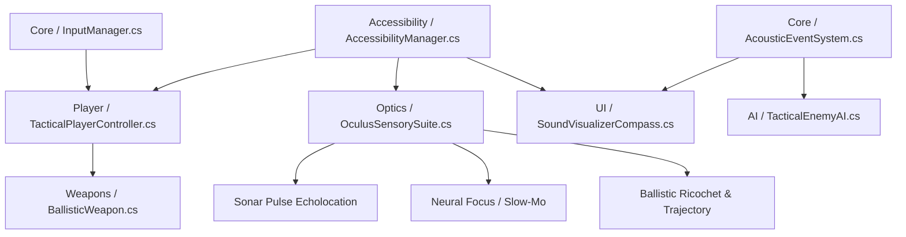

# 🧠 PROJECT MEMORY & MULTI-AGENT COORDINATION PROTOCOL
**Project:** *Echoes of Neon* — Accessible Tactical Cyber-Noir FPS  
**Target Engine:** Unity 6 / Unity 2022+ (Universal Render Pipeline - URP)  
**Location:** `Desktop/EchoesOfNeon/`  
**Last Updated:** 2026-09-05  

---

> [!IMPORTANT]
> ### 🤖 MANDATORY AI AGENT PROTOCOL (READ BEFORE MAKING CHANGES)
> If you are an AI agent working on this codebase:
> 1. **READ FIRST:** Review this entire `MEMORY.md` file before starting any task to understand current architecture, conventions, and active work.
> 2. **CHECK ACTIVE WORK:** Look at the **[Task Tracking & Roadmap](#-task-tracking--roadmap)** section to avoid duplicate work or stepping on in-progress tasks.
> 3. **PRESERVE ARCHITECTURE & PREVENT REGRESSIONS:**
>    - Do not refactor or remove existing public APIs/events without backward compatibility.
>    - Ensure all scripts adhere to decoupled event-driven architecture.
>    - Keep accessibility options modularized through `AccessibilityManager`.
> 4. **UPDATE THIS FILE AFTER EVERY TASK:** Whenever you create, modify, or test scripts, you **MUST** update:
>    - The **[Changelog & Activity Log](#-changelog--activity-log)** with your changes, files touched, and notes.
>    - The **[Task Tracking & Roadmap](#-task-tracking--roadmap)** status (mark tasks completed or add new sub-tasks).

---

## 🎮 Game Concept & Lore Bible

* **Title:** *Echoes of Neon*
* **Genre:** Single-Player Tactical / Methodical Cyber-Noir First-Person Shooter (FPS).
* **Setting:** *New Carthage* — A rain-slicked, neon-lit industrial metropolis controlled by monolithic mega-corporations.
* **Protagonist:** **Marcus "Echo" Cross**
  * Former military breach specialist turned industrial contractor.
  * Monolithic mega-corp **Aegis-Corvus Dynamics** murdered his family, stole his late wife's neural memory core, and destroyed his biological eyes to cover up illegal bioweapons experiments.
  * Rebuilt with an underground prototype cybernetic ocular suite (**Oculus Sensory Suite**), Marcus seeks revenge and answers.
* **Core Design Philosophy:** Accessibility is not an afterthought menu toggle—it is woven directly into the in-lore cyberware, HUD optics, acoustic visualization, and tactical pacing.

---

## 🏛️ Core Architectural Pillars & Systems



### 1. Accessibility & Assist Framework (`Assets/Scripts/Accessibility/`)
* **Colorblind Modes:** Full palette swaps (Protanopia, Deuteranopia, Tritanopia, High-Contrast Monochroma).
* **High-Contrast Silhouettes:** Screen-space outline shaders for enemies (red/amber), allies (cyan/green), and interactables (gold).
* **Granular Aim Assists:** Sliders for target friction (slowdown over targets) and soft magnetic snap-to-target.
* **Motor Assists:** Single-stick navigation mode, full toggle vs. hold options (ADS, Sprint, Crouch), adjustable sensitivity curves.
* **Timescale Control:** Adjustable speed multiplier during *Neural Dilate* (slow-mo).
* **Sensory Cues:** Motion sickness reduction (camera bob toggle, screen shake scaling).

### 2. Dual-Input Versatility (`Assets/Scripts/Core/`)
* Built upon **Unity New Input System** (`UnityEngine.InputSystem`).
* Seamless hot-swapping between Keyboard & Mouse and Gamepads (Xbox, PlayStation, Generic).
* Full runtime remapping with persistent JSON serialization.
* Deadzone calibration and dynamic UI button glyph updates.

### 3. Oculus Sensory Suite (`Assets/Scripts/Optics/`)
* **Sonar Pulse (Echolocation):** Expanding acoustic wave that pings geometry edges, hidden enemies, and sound sources.
* **Neural Dilate (Focus Mode):** Overclocks perception to slow down game time (`Time.timeScale`) without making player controls sluggish.
* **Predictive Ballistics:** Real-time projected ricochet trajectory and laser sighting.

### 4. 3D Sound Visualizer Compass (`Assets/Scripts/UI/`)
* Captures spatial acoustic events from `AcousticEmitter` components.
* Plots directional radar blips around the HUD / crosshair:
  * 🟠 Orange = Gunfire / Explosions
  * 🔵 Cyan = Footsteps / Movement
  * 🟡 Yellow = Mechanical / Alert Barks
* Integrated with enhanced subtitles (speaker portraits, directional indicators, high-contrast backgrounds).

### 5. Ballistic Combat & Tactical AI (`Assets/Scripts/Weapons/` & `Assets/Scripts/AI/`)
* **Vanguard 9 Suppressed Pistol:** Modular cyberware weapon framework (semi-auto, recoil damping, laser guide).
* **Acoustic Stealth Loop:** Enemies respond to noise radius and visual lines of sight; player uses sonar to assess threat levels.

---

## 📁 Directory Structure & File Map

```
EchoesOfNeon/
├── Assets/
│   ├── Scenes/                 # Level grayboxes, test ranges, lighting setups
│   ├── Scripts/
│   │   ├── Core/               # InputManager, GameManager, AcousticEventSystem
│   │   ├── Player/             # TacticalPlayerController, PlayerMotor, PlayerHealth
│   │   ├── Accessibility/      # AccessibilityManager, ColorblindProfile, InputRemapData
│   │   ├── Optics/             # OculusSensorySuite, SonarPingEmitter, TrajectoryDrawer
│   │   ├── Weapons/            # BallisticWeapon, Projectile, WeaponCyberMod
│   │   ├── AI/                 # TacticalEnemyAI, AcousticEmitter, VisionCone
│   │   └── UI/                 # SoundVisualizerCompass, SubtitleDisplay, AccessibilityMenuUI
│   └── Shaders/                # HighContrastOutline, SonarPulseWave, ScreenSpaceSilhouette
├── Docs/                       # Design specifications, control diagrams, narrative bibles
├── MEMORY.md                   # 🧠 THIS FILE - Master context and agent synchronization
└── README.md                   # Quickstart guide for opening in Unity
```

---

## 🎯 Task Tracking & Roadmap

Reordered into phases 2026-09-09 to put input first (explicit user priority:
keyboard **and** game controller support) and to call out the screen-reader
architecture decision below. See the Changelog for tooling setup detail.

> [!IMPORTANT]
> ### 🦯 Screen-reader architecture decision (2026-09-09)
> Menus/UI use **Unity 6.3's native `AccessibilityNode`/`AccessibilityHierarchy`
> API** (`UnityEngine.Accessibility`), which exposes UI through Windows UI
> Automation — the same standard API NVDA reads other apps through. This is
> *why* the project targets **Unity 6.3 (`6000.3.23f1`)** instead of the 6.0
> LTS line, which predates this API entirely. Unity's own docs only list
> "Windows Narrator" as tested, not NVDA by name, but the mechanism is
> standard UIA, not Narrator-specific — NVDA compatibility is expected but
> **not yet empirically verified**; confirm live once a menu exists.
> **Live gameplay does not go through a screen reader at all** — that's what
> the Oculus Sensory Suite (sonar echolocation, sound-visualizer compass) is
> *for*. Screen readers are for static menu/UI screens only.

| Phase | Task / Feature | Module | Status | Owner / Agent | Target File(s) |
| :--- | :--- | :--- | :--- | :--- | :--- |
| 0 | Project Folder Scaffolding | Setup | ✅ Completed | System | Root directory structure |
| 0 | Multi-Agent Memory & Protocol | Docs | ✅ Completed | System | `MEMORY.md`, `README.md` |
| 0 | Unity Hub + Unity 6.3 Editor + Windows IL2CPP install | Tooling | ✅ Completed | Claude | n/a (machine-level) |
| 0 | Git repo + GitHub remote (`Zatoichi420/EchoesOfNeon`, private) | Tooling | ✅ Completed | Claude | `.gitignore` |
| 0 | Real Unity project (`ProjectSettings/`, `Packages/manifest.json`) | Setup | ✅ Completed | Claude | project root |
| 1 | Input System + URP packages installed, `activeInputHandler` set | Core | ✅ Completed | Claude | `Packages/manifest.json`, `ProjectSettings/ProjectSettings.asset` |
| 1 | `InputManager.cs` (New Input System — keyboard + gamepad) | Core | ✅ Completed (untested in a live scene) | Claude | `Assets/Scripts/Core/InputManager.cs` |
| 2 | `AccessibilityManager.cs` (incl. native screen-reader hookup) | Accessibility | ⏳ In Backlog | Unassigned | `Assets/Scripts/Accessibility/AccessibilityManager.cs` |
| 3 | `TacticalPlayerController.cs` | Player | ⏳ In Backlog | Unassigned | `Assets/Scripts/Player/TacticalPlayerController.cs` |
| 4 | `OculusSensorySuite.cs` | Optics | ⏳ In Backlog | Unassigned | `Assets/Scripts/Optics/OculusSensorySuite.cs` |
| 5 | `SoundVisualizerCompass.cs` | UI | ⏳ In Backlog | Unassigned | `Assets/Scripts/UI/SoundVisualizerCompass.cs` |
| 5 | `AcousticEventSystem.cs` & `AcousticEmitter.cs` | Core / AI | ⏳ In Backlog | Unassigned | `Assets/Scripts/Core/AcousticEventSystem.cs` |
| 6 | `BallisticWeapon.cs` (Vanguard 9) | Weapons | ⏳ In Backlog | Unassigned | `Assets/Scripts/Weapons/BallisticWeapon.cs` |
| 6 | `TacticalEnemyAI.cs` | AI | ⏳ In Backlog | Unassigned | `Assets/Scripts/AI/TacticalEnemyAI.cs` |
| 6 | Post-Process Sonar & Outline Shaders | Shaders | ⏳ In Backlog | Unassigned | `Assets/Shaders/SonarPulseEffect.shader` |
| 6 | Graybox Firing Range / Stealth Level | Scenes | ⏳ In Backlog | Unassigned | `Assets/Scenes/TestRange_Proto.unity` |

---

## 📜 Changelog & Activity Log

> **How to log an entry:** Add new entries to the top of this table when completing or handing off work.

| Date & Time | Agent / Role | Action Summary | Files Touched / Created | Notes & Next Steps |
| :--- | :--- | :--- | :--- | :--- |
| **2026-09-09 (later)** | Claude | **Real Unity project created** at the project root via `Unity.exe -batchmode -createProject` (existing docs/folders preserved). Editor ended up as **6000.6.0f1** (not the originally-targeted 6000.3.23f1) after the user completed the install via Hub's GUI themselves - still has the native accessibility API (6.3+ requirement satisfied). Installed `com.unity.inputsystem` (1.20.0) and `com.unity.render-pipelines.universal` (17.6.0) via a `PackageSetup.cs` editor utility using Package Manager's own resolver (avoids hand-pinning versions). `com.unity.textmeshpro` as a standalone package is **not compatible** with this Unity version - don't retry it; TMP now ships via core UI packages instead. Set `activeInputHandler: 1` in ProjectSettings. Wrote and verified (clean batch-mode compile) `InputManager.cs` - see the file itself for the full action list; covers keyboard+gamepad for every planned action including the Oculus Sensory Suite's SonarPulse/NeuralDilate. **Gotcha worth remembering**: writing a script that references a not-yet-installed package's namespace, then trying to install that package in the *same* batch-mode session, fails - the broken script blocks compilation before the install method can even run. Move the script aside, install the package, move it back. | `Packages/manifest.json`, `ProjectSettings/ProjectSettings.asset`, `Assets/Editor/PackageSetup.cs`, `Assets/Scripts/Core/InputManager.cs` | Not yet tested in a live scene (no GameObject/scene wiring exists yet - InputManager.cs compiles but has never actually run). Next: Phase 2 (`AccessibilityManager.cs`), or first wire up a minimal test scene to confirm InputManager actually receives real input before building more on top of it. |
| **2026-09-09** | Claude | Tooling setup: installed Unity Hub + Unity 6.3 Editor (`6000.3.23f1`, chosen over 6.0 LTS specifically for its native screen-reader Accessibility API — see the decision note above) with Windows IL2CPP build support. Initialized git, added a standard Unity `.gitignore`, created private GitHub repo `Zatoichi420/EchoesOfNeon`. Reordered the task table into phases with input first per user request. | `.gitignore`, this file | Next: create the actual Unity project via the Editor's own project-creation flow (not hand-authored `ProjectSettings`), then start Phase 1 (`InputManager.cs`). |
| **2026-09-05** | Master Coordinator | Initialized Desktop project structure, created `MEMORY.md` and `README.md`. Set up multi-agent synchronization rules. | `MEMORY.md`, `README.md`, folder structure | Ready for agents to claim and implement core C# scripts. |
